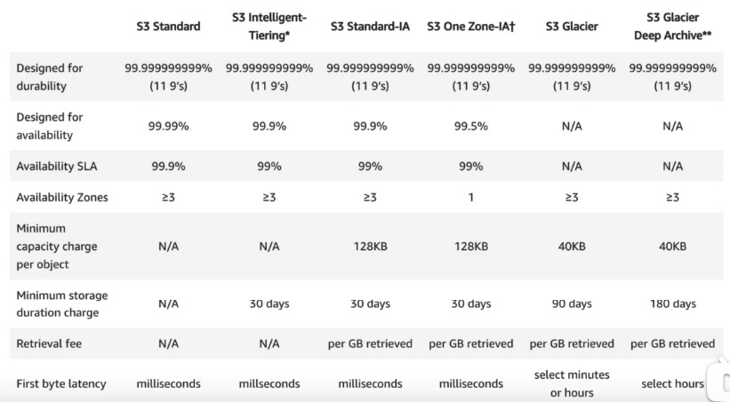

# S3 (Simple Storage Service)
- Object based
- file can be 0 to 5T
- unlimited storage
- name (DNS name) is global and unique
- 99.99% availability
- 99.999999999% (11*9s) durability
- Tiered
- Version
- Encryption
- MFA Delete
- Acceess Control List & Bucket Policies

## Key Fundamentals
- key
- value
- version ID
- metadata
- subresources

## S3 Storage Classes
- S3 Standard: 99.99% availability, 99.999999999% (11*9s) durability
- S3 -IA: less frrequently, rapid access. Lower fee + retrieval fee.
- S3 One Zone -IA:  infrrequently
- S3 Intelligent tiering
- S3 Glacier: low-cost, retrieval time from minutes to hours
- S3 Glacier Deep Archive: lowest-cost, retrieval 12 hours

