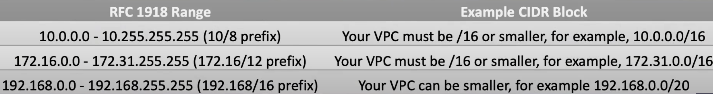

# VPC 
- AWS VPC Beginner to Pro - Virtual Private Cloud Tutorial
  - https://www.youtube.com/watch?v=g2JOHLHh4rI&ab_channel=freeCodeCamp.org

## Classless Interdomin Routing (CIDR)
CIDR use variable length subnets mask (VLSM)

## VPC overview
- VPC is a logically isolated porition within a region
VPC spans all the AZ in the region

- Subnet is created within a AZ

- VPC router takes care of routing within the VPC and outside of VPC
route table is used to configure the VPC router

- internet gateway is attaced to VPC and used to conenct to the internet

## Define CIDR Blocks
- CIDR block size can be beween /16 and /28
- CIDR must NOT overlap with any existing CIDR block that's associated with the VPC
- Can not increase or decrease the size of an existing CIDR block
- The first fore and last IP address are not available for use
- AWS recommand use RFC 1918 CIDR: 10/8 prefix, 172.16/12 prefix, 192.168/16 prefix

