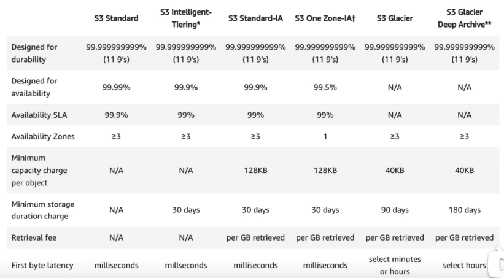
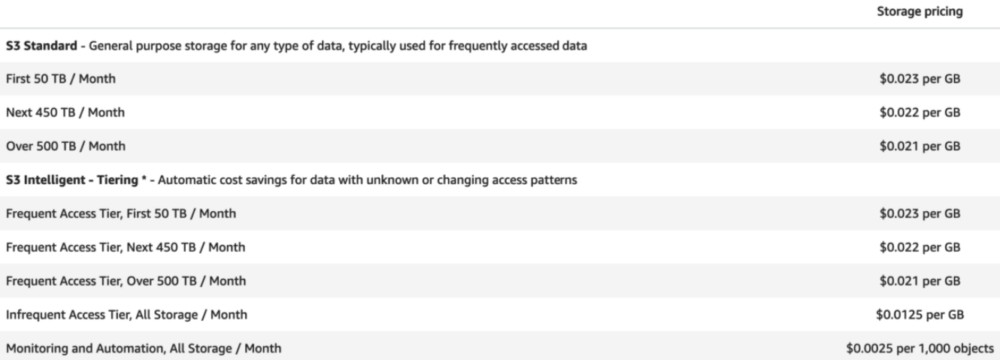

## What makes up the Cose of S3
- Storage
- Requests and Data retrievals
- Storage Management 
- Data Transfer 
- Thansfer Accesleration
- Cross Region Replication

## S3 Storage Classes / Tiers
- S3 Standard: 99.99% availability, 99.999999999% (11*9s) durability
- S3 -IA: less frrequently, rapid access. Lower fee + retrieval fee.
- S3 One Zone -IA:  infrrequently
- S3 Intelligent tiering
- S3 Glacier: low-cost, retrieval time from minutes to hours
- S3 Glacier Deep Archive: lowest-cost, retrieval 12 hours

