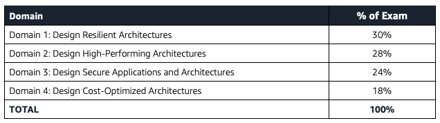
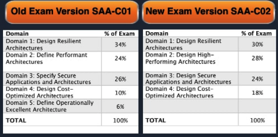

# AWS Certified Solutions Architect - Associate (SAA-C02)

Length: **130** minutes to complete the exam

Cost: **150** USD

Format: **65** questions, either multiple choice or multiple response

Qualification is valid for 2 years.

! AWS Certified Solutions Architect - Associate exam (SAA-C01) retired on June 30, 2020 and was replaced by exam SAA-C02.

## Official Web site
- https://aws.amazon.com/certification/exams/?nc2=sb_ce_exm

- https://aws.amazon.com/certification/certified-solutions-architect-associate/

AWS Certified Solutions Architect - Associate Exam Guide

AWS Certified Solutions Architect - Associate Sample Questions

AWS Certified Solutions Architect - Associate Official Practice Question Set

Exam Readiness: AWS Certified Solutions Architect - Associate

## Schedule an exam
https://aws.amazon.com/certification/exams/?nc2=sb_ce_exm

